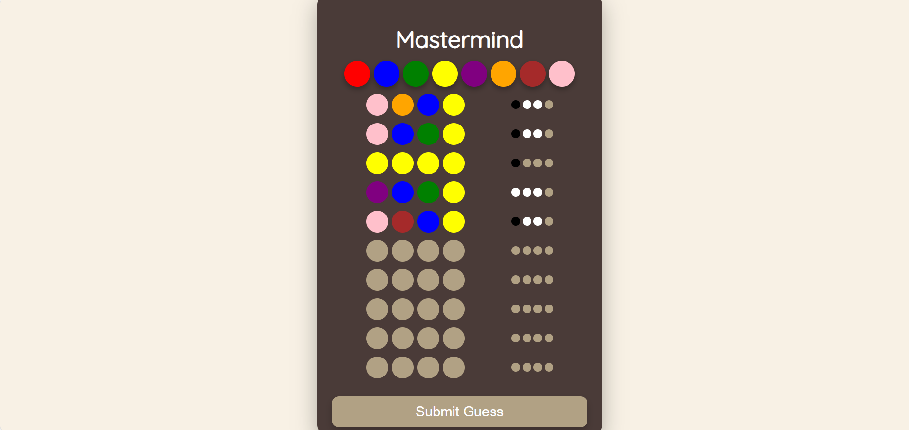

---

# Mastermind AI Solvers 🎮

Welcome to **Mastermind AI Solvers**, an advanced rendition of the timeless **Mastermind** game. Dive into the world of **AI-driven solvers** using **Genetic Algorithms** and **Q-Learning**, or test your code-breaking skills in **manual mode**. 

Whether you're here to play, experiment, or learn, this project brings the thrill of Mastermind with the power of modern AI!

---

## 🌟 Features

### 🎲 Game Modes
- **Manual Play**: Take control and try to crack the code yourself. Receive feedback for every guess.
- **AI Solvers**:
  - **Genetic Algorithm**: Watch as evolution works its magic to deduce the code.
  - **Q-Learning**: Experience reinforcement learning in action, as the AI agent learns and adapts.

### 🛠️ Extensible Design
- **Modular Architecture**:
  - Abstract `Solver` class enables easy addition of new solving strategies.
  - Strategy Design Pattern for dynamic fitness calculations.
- Centralized configuration in `config.py` for easy customization.

### 🌐 Interactive UI
- Fully responsive web interface built with **Flask**.
- Real-time updates on guesses, feedback, and solver progress.
- pages for **manual gameplay**, **Genetic Solver**, and **Q-Learning Solver**.

---

## 🏗️ Project Structure

```
The-Mastermind-Game/
├── fitness_strategies/
│   ├── fitness_strategy.py        # Abstract fitness strategy class
│   ├── peg_match_fitness.py       # Peg-based fitness calculation
├── solvers/
│   ├── solver.py                  # Abstract Solver class
│   ├── genetic_solver.py          # Genetic Algorithm Solver
│   ├── q_learning_solver.py       # Q-Learning Solver
├── static/
│   ├── styles.css                 # CSS for web styling
├── templates/
│   ├── menu.html                  # Main menu page
│   ├── manual_game.html           # Manual gameplay page
│   ├── genetic_agent.html         # Genetic algorithm page
│   ├── q_learning_agent.html      # Q-Learning solver page
├── app.py                         # Flask application
├── config.py                      # Configurable parameters for solvers and gameplay
├── solvers_factory.py             # Factory for creating solvers
```

---

## 🚀 Quick Start

### 1. Clone the Repository
```bash
git clone https://github.com/yourusername/The-Mastermind-Game.git
cd The-Mastermind-Game
```

### 2. Run the Flask Application
```bash
python app.py
```

### 4. Open in Browser
Visit [http://127.0.0.1:5000](http://127.0.0.1:5000) to start your game.

---

## 🔧 Configuration

Default parameters can be customized in `config.py`.

---

## 🧠 Solvers Overview

### **Abstract Solver**
- A base class that all solvers inherit from, with a required `solve()` method.
- Designed to ensure flexibility and extensibility.

### **Genetic Algorithm Solver**
- Simulates natural selection to find the secret code.
- Key techniques:
  - **Crossover**: Combines two parents to produce offspring.
  - **Mutation**: Randomly alters offspring for diversity.
  - **Permutation**: Swaps the positions of two genes to introduce variability.
  - **Inversion**: Reverses a portion of the genes to explore new patterns.
  - **Fitness Calculation**: Evaluates the suitability of guesses based on feedback.

### **Q-Learning Solver**
- Uses reinforcement learning to adapt and improve guesses over time.
- Maintains a **Q-Table** that maps state-action pairs to their expected rewards.

---

## 🌟 Features to Explore

### Manual Play
- Test your skills in guessing the secret code.
- Receive detailed feedback for every guess.

### AI Solvers in Action
- Watch as the **Genetic Algorithm** evolves guesses across generations.
- Observe the **Q-Learning Agent** learning and improving with each iteration.

### Customizable Simulations
- Adjust parameters like the number of colors and code length to experiment with solver performance.

---
## Screenshots

### Game Menu


### Manual Gameplay


### Q-Learning Solver in Action


### Genetic Algorithm Solver


---

## 🌟 Let's Play Mastermind! 🎉

Rediscover the joy of **Mastermind** with the power of **AI Solvers**. Dive in, challenge the solvers, or let the AI blow your mind!
